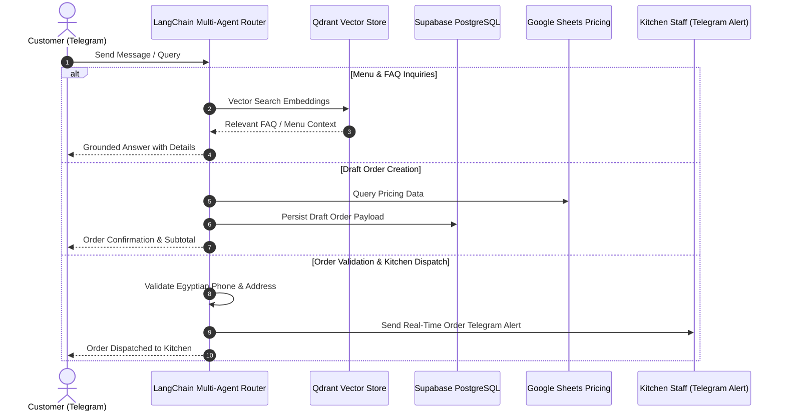

# ⚡ Gourmet Bistro Multi-Agent AI Customer Service & Ordering System

**Category:** `AI Chatbots & Conversational Commerce`  
*Multi-agent LangChain structure for restaurant customer service, RAG vector search, order creation, and kitchen dispatch.*

     

[Main Portfolio Hub](https://github.com/Sohila-Khaled-Abbas/n8n-production-queue-setup) · [Architecture & Principles](#-software-engineering-architecture--standards) · [How to Import](#-how-to-import-and-run)

---

## 💡 Business Case & Value

Enforces strict business rules (phone validation, delivery checks, 5-minute cancellation grace period) while reducing front-of-house customer service load by up to 80%.

---

## 🏗️ Software Engineering Architecture & Standards

This repository adheres to strict software engineering standards to guarantee reliability, maintainability, and clean decoupling:

### 1. Architectural Decoupling & Boundaries
- **Single Responsibility Principle:** Each node or sub-workflow handles a distinct responsibility (Trigger parsing, AI logic, DB persistence, or Notification dispatch).
- **Loose Coupling:** Inter-node communication relies on structured JSON contracts. Data transformations are encapsulated inside dedicated Code nodes.

### 2. Resilience & Error Handling
- **Idempotent Operations:** State modifications in persistent databases (PostgreSQL, MSSQL, Google Sheets) use upsert keys to prevent duplicate records on retries.
- **Graceful Degradation & Retries:** External API connections feature automatic retry conditions (e.g. 503 cold start protections, HTTP timeout configurations).

### 3. Security & Zero-Trust Secrets
- **No Hardcoded Credentials:** All API keys, bot tokens, and database passwords are isolate via n8n Credential Stores and `.env` environment variables.

---

## 📐 System Architecture & Data Flow

---

## 🛠️ Tech Stack & Integration Details

- **Workflow Engine:** n8n Automation Stack
- **Active Integrations:** n8n, LangChain Multi-Agent, Qdrant Vector DB, Google Sheets, Supabase PostgreSQL, Telegram Bot API
- **Total Nodes:** `32`
- **Node Breakdown:** `telegramTrigger`, `set`, `lmChatOllama`, `switch`, `embeddingsOllama`, `memoryPostgresChat`, `vectorStoreSupabase`, `googleSheets`, `code`, `if`, `telegram`, `agent`, `supabase`, `telegramTool`, `timeSaved`, `chainLlm`, `informationExtractor`
- **Trigger Mechanisms:** `Telegram Trigger`
- **Topics & Tags:** `#n8n` `#n8n-workflow` `#langchain` `#multi-agent` `#rag` `#qdrant` `#telegram-bot` `#supabase` `#software-engineering`

---

## 🧪 Quality Assurance & CI/CD

This repository includes an automated **GitHub Actions CI/CD Pipeline** ([`validate-workflow.yml`](.github/workflows/validate-workflow.yml)) that validates `workflow.json` on every commit:
- ✅ **JSON Schema Linting:** Verifies valid JSON syntax and root structure.
- ✅ **Node Contract Audit:** Ensures node parameters and connections are unbroken.
- ✅ **Secret Scanning Guard:** Verifies no unencrypted API keys exist in plain text.

---

## 🚀 How to Import and Run

To import this workflow into your n8n instance:

1. **Download Workflow JSON:**
   Download the [`workflow.json`](workflow.json) file from this repository.

2. **Import into n8n:**
   - Open your n8n Editor UI.
   - Click on **Workflow Menu** -> **Import from File...** (or copy raw JSON content and paste directly into canvas with `Ctrl + V` / `Cmd + V`).

3. **Configure Credentials:**
   - Provision required API credentials in n8n for (n8n, LangChain Multi-Agent, Qdrant Vector DB).

4. **Activate & Test:**
   - Toggle the workflow switch to **Active** and test execution.

---

## 🔗 Related Portfolio Workflows

This workflow is part of the **Production n8n Workflow Portfolio**. Explore more production-grade workflows in the main hub:  
👉 **[https://github.com/Sohila-Khaled-Abbas/n8n-production-queue-setup](https://github.com/Sohila-Khaled-Abbas/n8n-production-queue-setup)**

---

## 📄 License
Released under the [MIT License](LICENSE).
